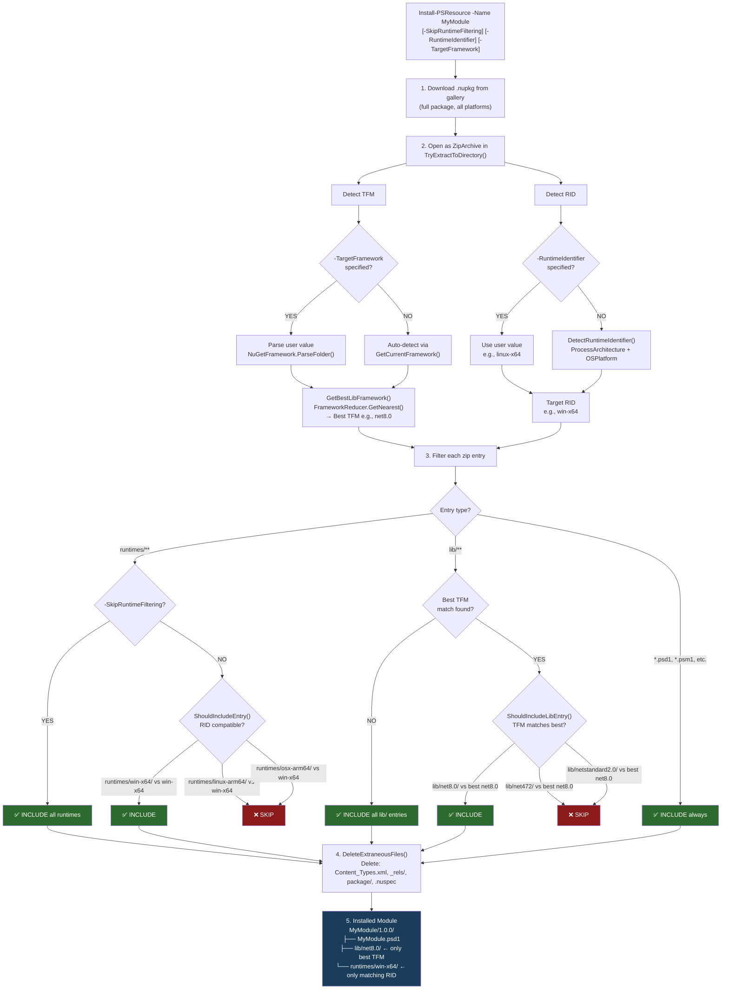
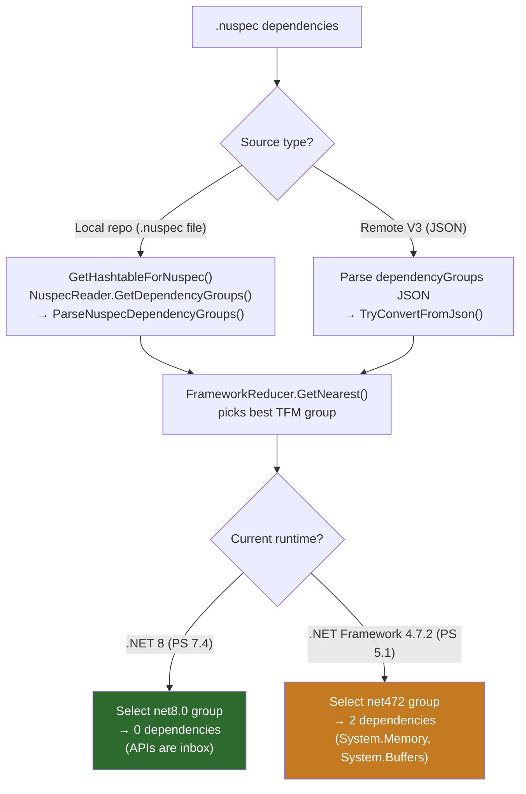
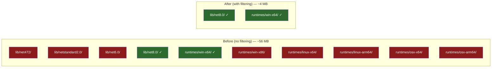
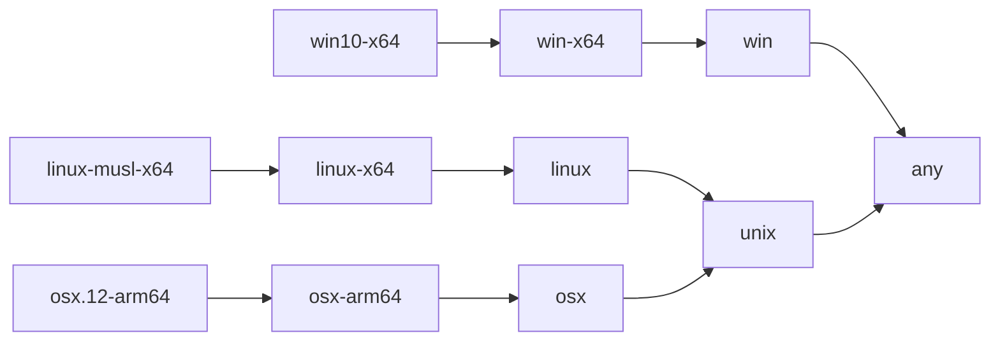

# Platform-Aware Installation Flow

## Extraction Filtering Pipeline

### Code References

| Diagram Step | Method | File |
|---|---|---|
| Cmdlet parameters | `SkipRuntimeFiltering`, `RuntimeIdentifier`, `TargetFramework` | [InstallPSResource.cs#L147](src/code/InstallPSResource.cs#L147) |
| TryExtractToDirectory | Entry point for filtered extraction | [InstallHelper.cs#L1181](src/code/InstallHelper.cs#L1181) |
| GetCurrentFramework | Auto-detect TFM from `RuntimeInformation.FrameworkDescription` | [InstallHelper.cs#L1394](src/code/InstallHelper.cs#L1394) |
| GetBestLibFramework | `FrameworkReducer.GetNearest()` for lib/ selection | [InstallHelper.cs#L1289](src/code/InstallHelper.cs#L1289) |
| ShouldIncludeLibEntry | Filter lib/ entries against best TFM | [InstallHelper.cs#L1358](src/code/InstallHelper.cs#L1358) |
| DetectRuntimeIdentifier | Auto-detect RID from OS + architecture | [RuntimeIdentifierHelper.cs#L204](src/code/RuntimeIdentifierHelper.cs#L204) |
| ShouldIncludeEntry | Filter runtimes/ entries against target RID | [RuntimePackageHelper.cs#L83](src/code/RuntimePackageHelper.cs#L83) |
| DeleteExtraneousFiles | Cleanup: remove NuGet packaging artifacts | [InstallHelper.cs#L1709](src/code/InstallHelper.cs#L1709) |

## Dependency Parsing (TFM-Aware)

### Code References

| Diagram Step | Method | File |
|---|---|---|
| GetHashtableForNuspec | `NuspecReader` parses .nuspec for local repos | [LocalServerApiCalls.cs#L958](src/code/LocalServerApiCalls.cs#L958) |
| TryConvertFromJson | Parses V3 JSON dependency groups for remote repos | [PSResourceInfo.cs#L618](src/code/PSResourceInfo.cs#L618) |
| ParseNuspecDependencyGroups | TFM-aware group selection via `FrameworkReducer` | [PSResourceInfo.cs#L1704](src/code/PSResourceInfo.cs#L1704) |

## Before vs After

## RID Compatibility Chain

