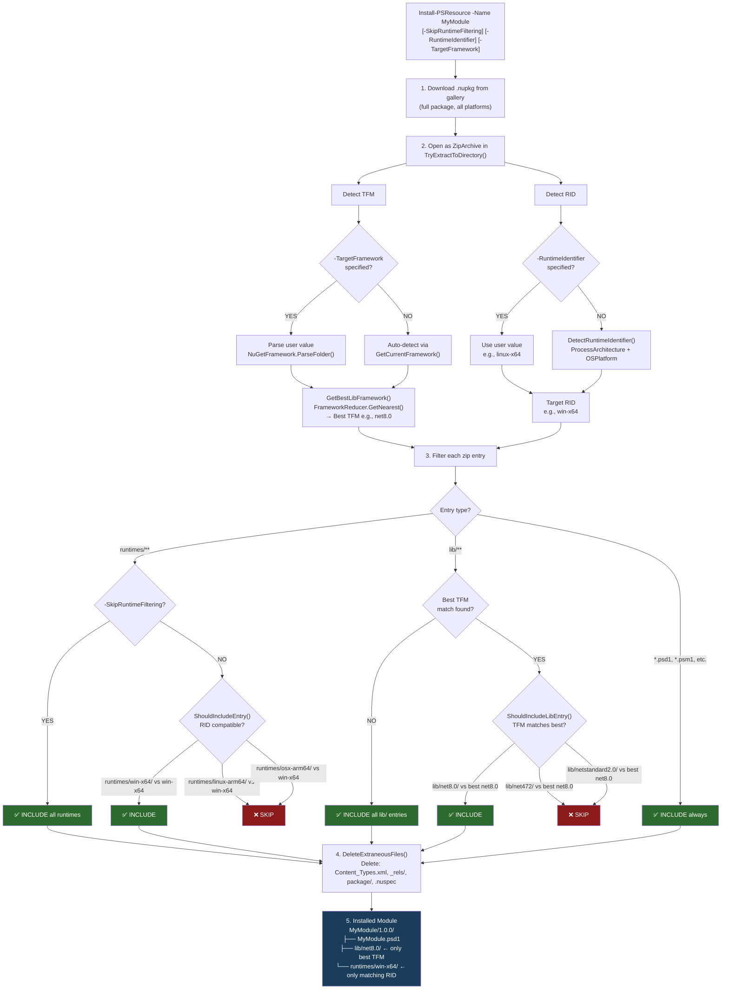
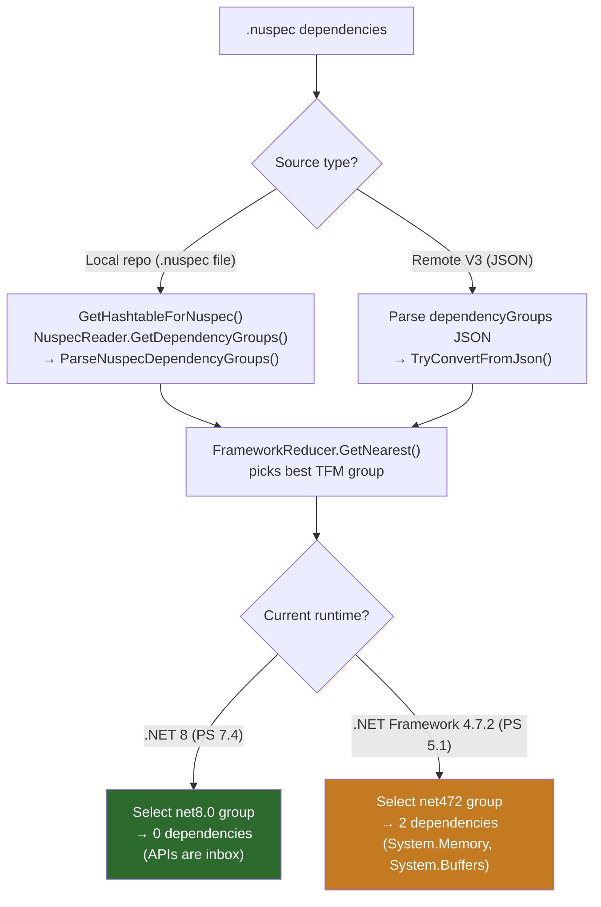
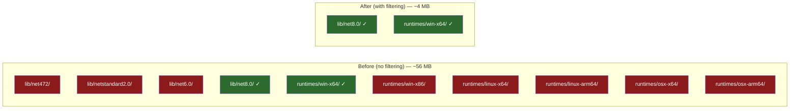
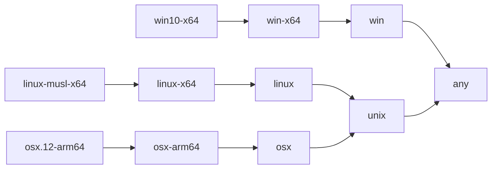

# Platform-Aware Installation Flow

## Extraction Filtering Pipeline

```mermaid
flowchart TD
    A["Install-PSResource -Name MyModule<br/>[-SkipRuntimeFiltering] [-RuntimeIdentifier] [-TargetFramework]"] --> B["1. Download .nupkg from gallery<br/>(full package, all platforms)"]
    B --> C["2. Open as ZipArchive in TryExtractToDirectory()"]
    C --> D["Detect TFM"]
    C --> E["Detect RID"]

    D --> D1{"-TargetFramework<br/>specified?"}
    D1 -->|YES| D2["Parse user value<br/>NuGetFramework.ParseFolder()"]
    D1 -->|NO| D3["Auto-detect via<br/>GetCurrentFramework()"]
    D2 --> D4["GetBestLibFramework()<br/>FrameworkReducer.GetNearest()<br/>→ Best TFM e.g., net8.0"]
    D3 --> D4

    E --> E1{"-RuntimeIdentifier<br/>specified?"}
    E1 -->|YES| E2["Use user value<br/>e.g., linux-x64"]
    E1 -->|NO| E3["DetectRuntimeIdentifier()<br/>ProcessArchitecture + OSPlatform"]
    E2 --> E4["Target RID<br/>e.g., win-x64"]
    E3 --> E4

    D4 --> F["3. Filter each zip entry"]
    E4 --> F

    F --> G{"Entry type?"}

    G -->|"runtimes/**"| H{"-SkipRuntimeFiltering?"}
    H -->|YES| I["✅ INCLUDE all runtimes"]
    H -->|NO| J{"ShouldIncludeEntry()<br/>RID compatible?"}
    J -->|"runtimes/win-x64/ vs win-x64"| K["✅ INCLUDE"]
    J -->|"runtimes/linux-arm64/ vs win-x64"| L["❌ SKIP"]
    J -->|"runtimes/osx-arm64/ vs win-x64"| L

    G -->|"lib/**"| M{"Best TFM<br/>match found?"}
    M -->|NO| N["✅ INCLUDE all lib/ entries"]
    M -->|YES| O{"ShouldIncludeLibEntry()<br/>TFM matches best?"}
    O -->|"lib/net8.0/ vs best net8.0"| P["✅ INCLUDE"]
    O -->|"lib/net472/ vs best net8.0"| Q["❌ SKIP"]
    O -->|"lib/netstandard2.0/ vs best net8.0"| Q

    G -->|"*.psd1, *.psm1, etc."| R["✅ INCLUDE always"]

    K --> S["4. DeleteExtraneousFiles()<br/>Delete: Content_Types.xml, _rels/, package/, .nuspec"]
    I --> S
    N --> S
    P --> S
    R --> S

    S --> T["5. Installed Module<br/>MyModule/1.0.0/<br/>├── MyModule.psd1<br/>├── lib/net8.0/ ← only best TFM<br/>└── runtimes/win-x64/ ← only matching RID"]

    click A "src/code/InstallPSResource.cs#L147" "InstallPSResource.cs — cmdlet parameters"
    click C "src/code/InstallHelper.cs#L1181" "InstallHelper.TryExtractToDirectory()"
    click D3 "src/code/InstallHelper.cs#L1394" "InstallHelper.GetCurrentFramework()"
    click D4 "src/code/InstallHelper.cs#L1289" "InstallHelper.GetBestLibFramework()"
    click E3 "src/code/RuntimeIdentifierHelper.cs#L204" "RuntimeIdentifierHelper.DetectRuntimeIdentifier()"
    click J "src/code/RuntimePackageHelper.cs#L83" "RuntimePackageHelper.ShouldIncludeEntry()"
    click O "src/code/InstallHelper.cs#L1358" "InstallHelper.ShouldIncludeLibEntry()"
    click S "src/code/InstallHelper.cs#L1709" "InstallHelper.DeleteExtraneousFiles()"

    style K fill:#2d6a2d,color:#fff
    style I fill:#2d6a2d,color:#fff
    style N fill:#2d6a2d,color:#fff
    style P fill:#2d6a2d,color:#fff
    style R fill:#2d6a2d,color:#fff
    style L fill:#8b1a1a,color:#fff
    style Q fill:#8b1a1a,color:#fff
    style T fill:#1a3d5c,color:#fff
```

## Dependency Parsing (TFM-Aware)

```mermaid
flowchart TD
    A[".nuspec dependencies"] --> B{"Source type?"}
    
    B -->|"Local repo (.nuspec file)"| C["GetHashtableForNuspec()<br/>NuspecReader.GetDependencyGroups()<br/>→ ParseNuspecDependencyGroups()"]
    B -->|"Remote V3 (JSON)"| D["Parse dependencyGroups JSON<br/>→ TryConvertFromJson()"]
    
    C --> E["FrameworkReducer.GetNearest()<br/>picks best TFM group"]
    D --> E
    
    E --> F{"Current runtime?"}
    
    F -->|".NET 8 (PS 7.4)"| G["Select net8.0 group<br/>→ 0 dependencies<br/>(APIs are inbox)"]
    F -->|".NET Framework 4.7.2 (PS 5.1)"| H["Select net472 group<br/>→ 2 dependencies<br/>(System.Memory, System.Buffers)"]

    click C "src/code/LocalServerApiCalls.cs#L958" "LocalServerApiCalls.GetHashtableForNuspec()"
    click D "src/code/PSResourceInfo.cs#L618" "PSResourceInfo.TryConvertFromJson()"
    click E "src/code/PSResourceInfo.cs#L1704" "PSResourceInfo.ParseNuspecDependencyGroups()"
    
    style G fill:#2d6a2d,color:#fff
    style H fill:#c47a20,color:#fff
```

## Before vs After

```mermaid
graph LR
    subgraph BEFORE["Before (no filtering) — ~56 MB"]
        B1["lib/net472/"]
        B2["lib/netstandard2.0/"]
        B3["lib/net6.0/"]
        B4["lib/net8.0/ ✓"]
        B5["runtimes/win-x64/ ✓"]
        B6["runtimes/win-x86/"]
        B7["runtimes/linux-x64/"]
        B8["runtimes/linux-arm64/"]
        B9["runtimes/osx-x64/"]
        B10["runtimes/osx-arm64/"]
    end

    subgraph AFTER["After (with filtering) — ~4 MB"]
        A1["lib/net8.0/ ✓"]
        A2["runtimes/win-x64/ ✓"]
    end

    style B1 fill:#8b1a1a,color:#fff
    style B2 fill:#8b1a1a,color:#fff
    style B3 fill:#8b1a1a,color:#fff
    style B4 fill:#2d6a2d,color:#fff
    style B5 fill:#2d6a2d,color:#fff
    style B6 fill:#8b1a1a,color:#fff
    style B7 fill:#8b1a1a,color:#fff
    style B8 fill:#8b1a1a,color:#fff
    style B9 fill:#8b1a1a,color:#fff
    style B10 fill:#8b1a1a,color:#fff
    style A1 fill:#2d6a2d,color:#fff
    style A2 fill:#2d6a2d,color:#fff
```

## RID Compatibility Chain

```mermaid
flowchart LR
    W1["win10-x64"] --> W2["win-x64"] --> W3["win"] --> ANY["any"]
    L1["linux-musl-x64"] --> L2["linux-x64"] --> L3["linux"] --> U["unix"] --> ANY
    O1["osx.12-arm64"] --> O2["osx-arm64"] --> O3["osx"] --> U

    click W1 "src/code/RuntimeIdentifierHelper.cs#L301" "BuildCompatibleRidList()"
```
